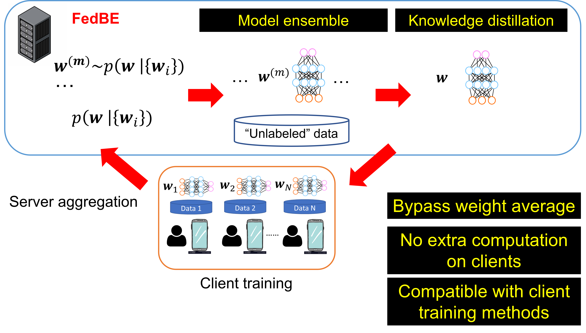

# FedBE: Making Bayesian Model Ensemble Applicable to Federated Learning
Federated learning aims to collaboratively train a strong global model by accessing
users’ locally trained models but not their own data. A crucial step is therefore to
aggregate local models into a global model, which has been shown challenging
when users have non-i.i.d. data. In this paper, we propose a novel aggregation algorithm named FedBE, which takes a Bayesian inference perspective by sampling
higher-quality global models and combining them via Bayesian model Ensemble,
leading to much robust aggregation. We show that an effective model distribution
can be constructed by simply fitting a Gaussian or Dirichlet distribution to the local
models. Our empirical studies validate FedBE’s superior performance, especially
when users’ data are not i.i.d. and when the neural networks go deeper. Moreover,
FedBE is compatible with recent efforts in regularizing users’ model training,
making it an easily applicable module: you only need to replace the aggregation
method but leave other parts of your federated learning algorithm intact



## Citation
This repository also implements parallelized client training in PyTorch. Please cite us if you find it useful.  
Please email chen.9301[at]osu.edu for questions.
```
@inproceedings{chen2020fedbe,
  title={FedBE: Making Bayesian Model Ensemble Applicable to Federated Learning},
  author={Chen, Hong-You and Chao, Wei-Lun},
  booktitle = {ICLR},
  year={2021}
}
```

## References
Some codes are based on:  
* [shaoxiongji/federated-learning](https://github.com/shaoxiongji/federated-learning) 
* [timgaripov/swa](https://github.com/timgaripov/swa) 
* [wjmaddox/swa_gaussian](https://github.com/wjmaddox/swa_gaussian) 
